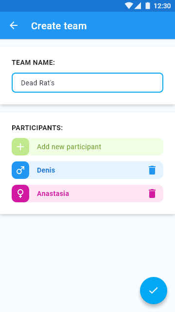
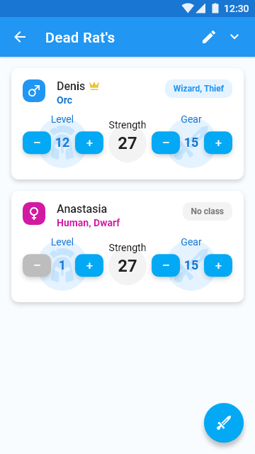
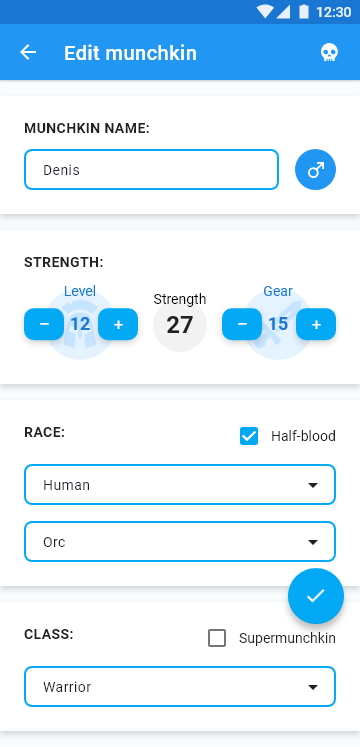
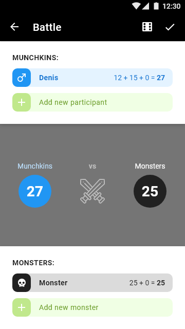

# supermunchkin
[2019] The app for the board game Munchkin

## WIP (Work In Progress): The project is not fully implemented!

### Technologies and approaches:
* Kotlin
* Clean architecture
* MVI
* Multi-module
* Koin
* RxJava 2
* Room

### Screenshots:
 

